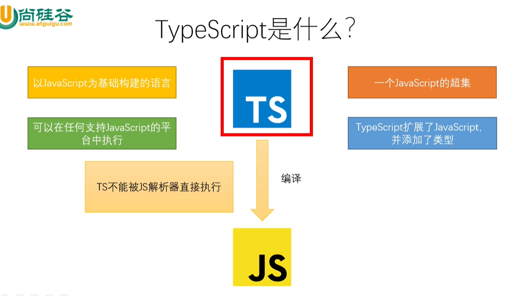

# TypeScript

##TS简介

###TypeScript是什么

- 以JavaScript为基础构建的语言
- 一个JavaScript的超集
- 可以在任何支持JavaScript的平台中执行
- TypeScript扩展了JavaScript并添加了类型
- TS不能被JS解析器直接执行


###TypeScript增加了什么

- 类型
- 支持ES的新特性
- 添加了ES布局被的新特性
- 丰富的配置选项
- 强大的开发工具

## TypeScript 开发环境搭建

1. 下载Node.js
2. 安装Node.js
3. 使用npm全局安装typescript
- 进入命令行
- 输入: npm i -g typescript
4. 创建一个ts文件
5.使用tsc对ts文件进行编译
- 进入命令行
- 进入ts文件所在目录
- 执行命令: tsc xxx.ts


## 基本类型

- 类型声明
    - 类型声明是TS非常重要的一个特点
    - 通过类型声明可以指定TS中变量(参数,形参)的类型
    - 指定类型后,当为变量赋值时,TS编译器会自动检查值是否符合类型声明,符合则赋值,否则报错
    - 简而言之,类型声明给变量设置了类型,使得变量只能存储某种类型的值
    - 语法
  
```typescript
let 变量: 类型;
let 变量: 类型 = 值
function fn(参数: 类型, 参数: 类型):类型{ ... }
```         


- 自动类型判断
    - TS拥有自动类型判断机制
    - 当对变量的声明何赋值同时进行的,TS编译器会自动判断变量的类型
    - 所以如果你的变量的声明和赋值同时进行的,可以省略掉类型声明
    
- 类型

| 类型 | 例子 | 描述|
|:---:|:---:|:---:|
| number | 1,-33,2.5 | 任意数字 |
| string| 'hi',"hi", | 任意字符串 |
| boolean | true,false | 布尔值true或false |
| 字面量 | 其本身 | 限制变量的值就是该字面量的值 |
| any | *  | 任意类型 |
| unknown | * | 类型安全的any |
| void | 控制(undefined) | 没有值(或undefined) |
| never | 没有值 | 不能是任何值 |
| object | {name:'悟空'} | 任意的js对象 |
| array | [1,2,3] | 任意js数组 |
| tuple | [4,5] | 元素,TS新增类型,固定长度的数组 |
| enum | enum[A,B] | 枚举,TS中新增类型 |


## TS 编译选项
> tsconfig.js是ts编辑器的配置文件,ts编辑器可以根据他的信息来对代码进行编译
> > 'include' 用来指定哪些TS文件需要被编译  
> >  `"./src/**/*"` 表示src目录下的任意目录任意文件会被编译  
> > 路径: **表示任意目录  
> >      *表示任意文件
> >```json     
> > "include": [
> >    "./src/**/*",
> > ],
> >```
> 
> > 'exclude' 用于指定哪些TS文件不需要被编译  
> > ```json
> > "exclude": [
> >    "./src/hello/**/*"
> > ]
> >```
>
> > extends 定义被继承的配置文件
> 
> > files指定被编译文件的列表,只有需要编译的文件少时才会用到
> 
> > compilerOptions  
> > 编译选项是配置文件中非常重要也比较复杂的配置选项  
> > 在compiler中包含多个子选项,用来完成对编译的配置  
> >  项目选择: 
> > > target 设置ts代码编译得目标版本  
> > >  - 可选值: ES3(默认),ES5,ES6/ES1015,ES7/ES2016,ES2017,ES2018,ES2019,ES2020,ESNext
> > > 示例:
> > > ```json
> > > "compilerOptions": {
> > >  "target": "ES6"
> > > }
> > > ```
> > > - 如上设置,我们所编写得ts代码将会被编译为ES6版本得js代码
> >
> > > lib 指定代码运行时所包含得库(宿主环境)  
> > > - 可选值: ,ES5,ES6/ES1015,ES7/ES2016,ES2017,ES2018,ES2019,ES2020,ESNext,DOM,WebWorker,ScriptHost...
> > > 示例:
> > > ```json
> > > "compilerOptions": {
> > >    "target": "ES6",
> > >    "lib": ["ES6","DOM"]
> > > }
> > > ```
> > 
> > > module 设置编译后代码使用得模块化系统  
> > > - 可选值: CommonJS,UMD,AMD,System,ES2020,ESNext,None
> > > 示例:
> > > ```json
> > > "compilerOptions": {
> > >    "target": "ES6",
> > >    "lib": ["ES6","DOM"],
> > >    "module": "CommonJS"
> > > }
> > >```
> > 
> > > outDir 编译后文件的所在目录  
> > > 默认情况下,编译后的js文件会和ts文件位于相同的目录,设置outDir后可以改变编译后文件的位置
> > > `"outDir": "/dist",`
> > 
> > > outFile 编译后代码和并为一个文件  
> > > `    "outFile": "/dist/app.js",`
> >
> > > allowJs 是否对Js文件进行编译,默认是false  
> > > `"allowJs": false,`
> > 
> > > checkJs 是否检查js代码是否符合语法规范,默认是false  
> > > `   "checkJs": false`
> >
> > > removeComments 是否移除注释,默认式false  
> > > `"removeComments": true,`
> >
> > >  `noEmit` 不生成编译后的文件,默认是false  
> > > `"noEmit": false,` 
> > 
> > >  noEmitOnError 当有错误的时候不生成编译后的文件默认值为false  
> > >  `"noEmitOnError": true`
> >
> > >  "alwaysStrict" 用来设置编译后的文件是否使用严格模式,默认为false  
> > > `  "alwaysStrict": true,`
> > 
> > >  noImplicitAny 是否允许隐式any类型默认为false  
> > > `  "alwaysStrict": true,`
> >
> > >  "noImplicitThis" 是否允许不明确类型的this  
> > >    ` "noImplicitThis": true,`
> >
> > > "strictNullChecks" 是否严格检查空值 默认为false 
> > > `"strictNullChecks": true`
> > 
> > > strict 所有严格检查的总开关,默认为fasle
> > > `"strict": true`